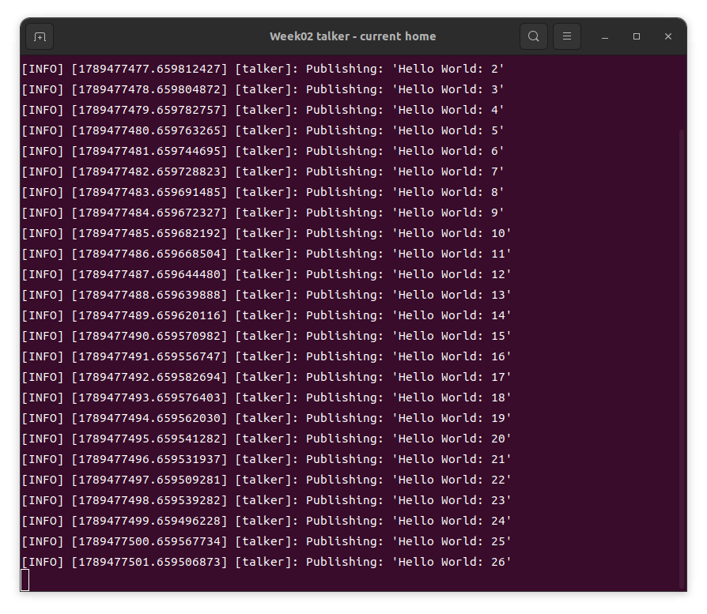
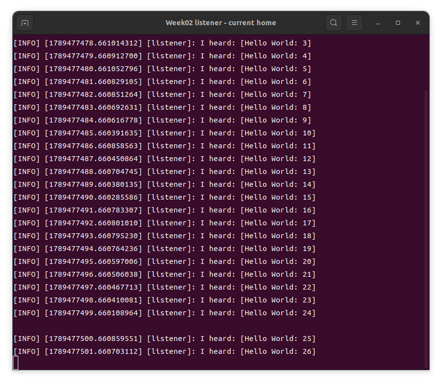

# week02 실습 정리

## 목표

ROS 2 Humble 환경에서 talker와 listener를 실행하고,
`/chatter` 토픽을 통한 메시지 발행·구독을 확인한다.

## 과정

### 1. 기본 데모 실행

각각 별도의 터미널에서 실행한다. 스크립트는 ROS 환경을 불러오고,
`demo_nodes_cpp`의 talker와 `demo_nodes_py`의 listener를 실행한다.
talker는 메시지를 보내는 노드이고, listener는 같은 토픽을 구독해 메시지를 받는 노드이다.

```bash
bash "$HOME/intelligent_robot_practice/week02/run_demo.sh" talker
```

```bash
bash "$HOME/intelligent_robot_practice/week02/run_demo.sh" listener
```

### 2. Python 코드 이해 및 실행

기본 데모와 같은 송수신 동작을 Python으로 구현한다.

- [talker.py](talker.py): `create_publisher()`로 `chatter` 토픽의 발행자를 만들고, `create_timer(1.0, ...)`으로 1초마다 번호가 증가하는 `String` 메시지를 보낸다.
- [listener.py](listener.py): `create_subscription()`으로 같은 토픽을 구독하고, 메시지가 도착하면 `receive_message()`에서 내용을 출력한다.
- `rclpy.spin()`은 노드가 타이머와 메시지 수신을 계속 처리하게 한다.

기본 데모를 Ctrl+C로 종료한 뒤 아래 명령을 각각 별도의 터미널에서 실행한다.
`source`는 ROS 환경을 불러오며, `ROS_LOCALHOST_ONLY=1`은 같은 PC 안에서 통신하도록 설정한다.

```bash
source /opt/ros/humble/setup.bash
export ROS_LOCALHOST_ONLY=1
python3 "$HOME/intelligent_robot_practice/week02/talker.py"
```

```bash
source /opt/ros/humble/setup.bash
export ROS_LOCALHOST_ONLY=1
python3 "$HOME/intelligent_robot_practice/week02/listener.py"
```

## 결과

기본 데모에서 talker가 발행한 `Hello World: N` 메시지를 listener가
수신하는 것을 확인했다.

```text
/talker → /chatter → /listener

[talker]: Publishing: 'Hello World: 1'
[listener]: I heard: [Hello World: 1]
```

| Talker | Listener |
| --- | --- |
|  |  |

[실습 보고서](실습보고서.odt) · [발행 로그](results/talker.log) · [수신 로그](results/listener.log)
