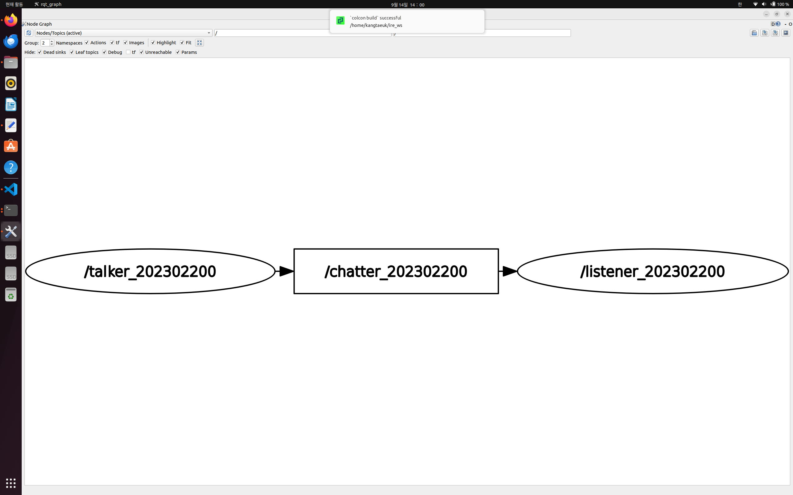
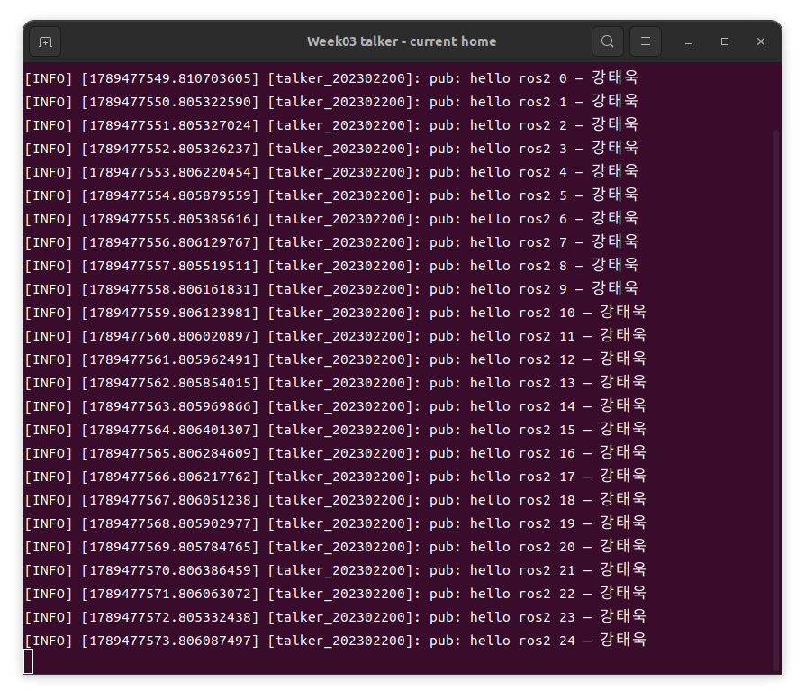
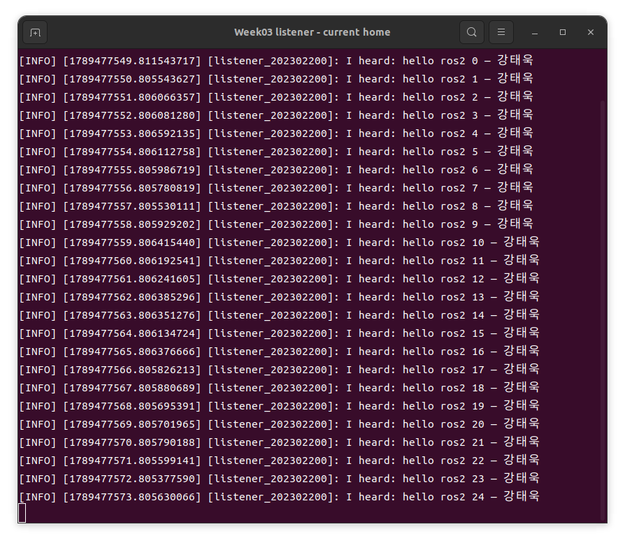

# Week 03 — ROS 2 Publisher / Subscriber 실습

- 이름: 강태욱
- 학번: 202302200
- 환경: ROS 2 Humble

## 실습 내용

`my_first_pkg`의 talker가 1초마다 `std_msgs/msg/String` 메시지를 발행하고, listener가 메시지를 구독하여 출력한다. 실행 스크립트에서 노드와 토픽 이름에 학번을 붙인다.

```text
/talker_202302200 → /chatter_202302200 → /listener_202302200
```

## 제출 파일

- `my_first_pkg/`: talker, listener 및 패키지 설정
- `run_pubsub.sh`: 학번을 적용하는 실행 스크립트
- `screenshots/rqt_graph_202302200.png`: 노드와 토픽 연결 확인 화면

## 실행 방법

패키지가 `~/ire_ws/src/my_first_pkg`에 있는 기존 실습 환경에서 빌드한다.

```bash
source /opt/ros/humble/setup.bash
cd "$HOME/ire_ws"
colcon build --packages-select my_first_pkg --symlink-install
```

각각 별도의 터미널에서 다음 명령을 실행한다. 스크립트는 ROS 2와 워크스페이스 환경을 자동으로 불러온다.

```bash
bash "$HOME/intelligent_robot_practice/week03/run_pubsub.sh" talker 202302200 강태욱
```

```bash
bash "$HOME/intelligent_robot_practice/week03/run_pubsub.sh" listener 202302200
```

```bash
bash "$HOME/intelligent_robot_practice/week03/run_pubsub.sh" graph
```

실행 스크립트의 기본 워크스페이스는 `$HOME/ire_ws`이다.
다른 워크스페이스를 사용하는 경우 각 실행 터미널에서 `IRE_WS`를 지정한다.

```bash
export IRE_WS="$HOME/ire_ws"
```

## rqt_graph 결과

아래 캡처에서 talker와 listener가 `/chatter_202302200` 토픽을 통해 연결되어 있음을 확인할 수 있다.



## 재실행 결과 — 2026-09-15

현재 홈 경로 `/home/ktw25079`에서 새 GNOME 터미널 두 개를 열어
각각 talker와 listener를 실행했습니다. 이번 검증에서는 두 터미널에
`ROS_DOMAIN_ID=79`, `ROS_LOCALHOST_ONLY=1`을 적용했습니다.
45초 실행 후 SIGINT로 종료했으며, 동일한 메시지 번호 **44개**의 발행·수신을 확인했습니다.

| Talker | Listener |
| --- | --- |
|  |  |

원본 실행 로그: [talker](results/talker.log), [listener](results/listener.log)
